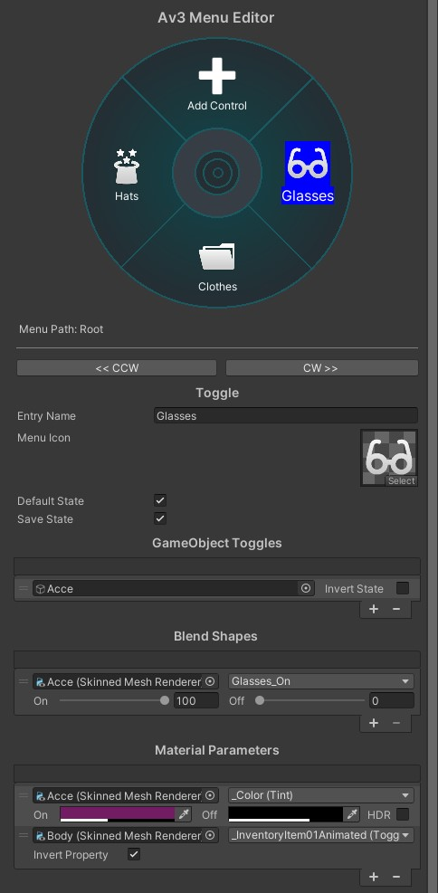

# Animator as Visual

A visual editor making use of [@hai-vr](https://github.com/hai-vr)'s [Animator As Code](https://github.com/hai-vr/av3-animator-as-code) and [@BlackStartx](https://github.com/BlackStartx)'s [VRC Gesture Manager](https://github.com/BlackStartx/VRC-Gesture-Manager).

## Installation

Install all required prerequisites:

* latest VRChat Avatar SDK (3.0 only!)
* [Animator As Code](https://github.com/hai-vr/av3-animator-as-code)
* **either** [VRC Gesture Manager](https://github.com/BlackStartx/VRC-Gesture-Manager) **or** (Av3 Emulator)[https://github.com/lyuma/Av3Emulator] (GestureManager version)

Download a build from the [Releases](https://github.com/pimaker/animator-as-visual/releases) tab and import it into your avatar project.

**NOTE: This project is in a very early state, I can _not_ guarantee that anything made with it now will survive an upgrade without having to re-do your menus!**

## Usage

Drag the 'AAV' prefab into your scene, and optionally "Unpack" it from the context menu.

Follow the instructions in the Inspector window. It's designed to be self-explanatory for ease of use, if you find something confusing or need help, feel free to ask on my [Discord Server](https://discord.gg/r38vJd2DuJ). Also try hovering over text in the editor, often there is a tooltip :+1:

# License

Licensed under the terms of the MIT license. See full text in `LICENSE`.